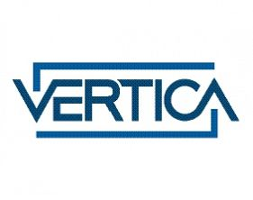
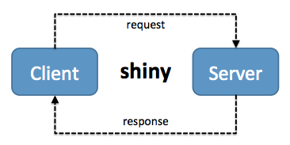

```{r setup, include=FALSE}
knitr::opts_chunk$set(echo = FALSE)
```


## O mnie
<div class = "row">
<div class = "col-md-3">

</div>
<div class = "col-md-3">
- backend developer: Java, SQL
- Data Scientist: R, SQL
</div>
</div>


## Kod do pobrania
<https://github.com/bkolasa/devcamp2017>


## Filary Data Science
{width=50% height=50%}

Źródło: <https://www.kdnuggets.com/2017/03/data-science-data-scientist-do.html>

## Oczekiwania klientów

- self service
- łatwość obsługi
- dobry design
- wydajność

## Wyzwania
- wydajność obliczeń
- dobry UX
- szybkośc implementacji

## Technologie
<div class = "row">
<div class = "col-sm-2">

</div>
<div class = "col-sm-2">

</div>
<div class = "col-sm-2">

</div>
</div>

## Dlaczego R?


Żródło: <https://stackoverflow.blog/2017/10/10/impressive-growth-r/>

## Dlaczego Vertica?
<div class = "row">
<div class = "col-md-3">

</div>
<div class = "col-md-3">
- horyzontalnie skalowana baza w architekturze multi-master
- wbudowana kompresja 
- dedykowana do rozwiązań analitycznych
- hybrydowy kolumnowy model składowania
</div>
</div>
## Dlaczego Vertica?


WOS = RAM <br> ROS = DISK STORAGE

## Dlaczego Vertica?

Wersja community:

- do 1 TB danych wejściowych
- do 3 nodów

Dostępna po zarejestrowaniu na <https://my.vertica.com>

## R crashcourse
Operator przypisania
```{r echo=TRUE, fig.cap="Operator przypisania"}
zmienna <- "wartosc"
"wartosc" -> zmienna
```
Deklaracja funkcji
```{r echo=TRUE, fig.cap="Operator przypisania"}
foo <- function(a,b){
  a+b
}
```
Ładowanie biblioteki
```{r echo=TRUE, eval=FALSE}
library(dplyr)
```

## R crashcourse
Ramki danych
```{r echo=TRUE}
read.csv("../stops.csv") -> stops
head(stops) -> df
df
```

## R crashcourse

Operator %>%
```{r eval=FALSE, echo=TRUE}
mpk_pos %>% head
mpk_pos %>% head()
head(mpk_pos)

mpk_pos %>% filter(lineno=="2") %>% head %>% print
print(head(filter(mpk_pos, lineno=="2")))
```

## Shiny
Biblioteka R do tworzenia interaktywnych wizualizacji
{width=60% heigth=60%}

## Dane do analizy

- pozycje autobusów wrocławskiego MPK z okresu 1.11.2016 do 28.02.2017
- łącznie 88 mln rekordów w tabeli `mpk_pos`
- słownik przystanków autobusowych w tabeli `stops`
